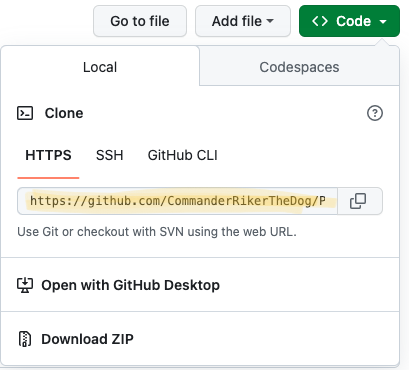
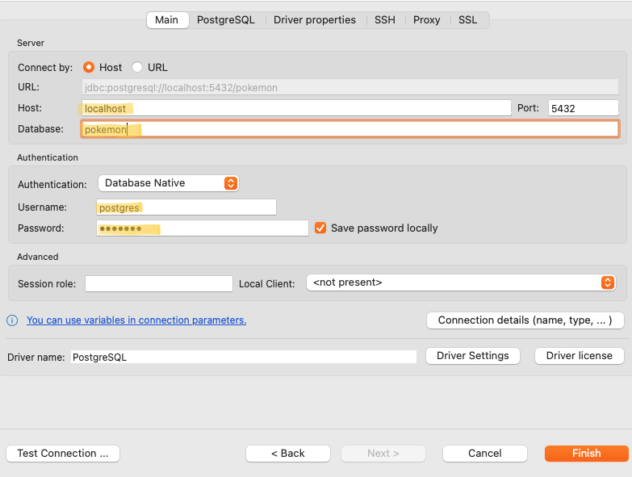

# Pokemon Project

## Prerequisites

- Download and install Docker desktop
- Download and install a sql client application; I recommend dbeaver

## Getting Started
### Part 1. Clone the repo
- Copy the project link <br>

- Open up your terminal, cd into the desired directory, then run this command to clone the repository
```bash 
git clone https://github.com/CommanderRikerTheDog/Pokemon.git
```

### Part 2. Build the Docker Container
- Launch Docker desktop application
    - It may ask you to login. If so, set up an account if you have not already, then login.
- Use terminal to cd into the project directory or open up the project from an IDE. If using an IDE, open up the terminal window from there.
- Run the following command in terminal

```bash
docker-compose up -d --no-deps --build postgres
```

### Part 3. Set up PostgreSQL connection in DBeaver
For this section, you will reference the **docker-compose.yaml** file located inside the project. 
- Launch DBeaver
- Set up a new database connection
    - Click on an the plug-icon with a plus sign located on the top left-hand side of the interface
   - Select PostgreSQL
   - Click neck
- Reference the **docker-compose.yaml* file. You can also fill it out as outlined below. 
    - Host: localhost
        - We keep this as the default
    - Database: pokemon
    - Username: postgres
    - Password: pokemon
    - Click “Finish”<br>
    
- At the final page, click “Proceed”.

You will now see a new database connection called “pokemon”

## Pokemon: Questions Answered
- Go back to your IDE and open **main.py**
- Run the code, then comment out lines 35 through 38.
    - This is to prevent duplicate data imports.
- Project questions will be answered on the Python console.

<br>
<br>
<br>
:biohazard::biohazard::biohazard::grimacing::grimacing::grimacing::biohazard::biohazard::biohazard:<br>

### Spoiler Alert
Question 1. What are the top 5 strongest non-legendary monsters? <br>
- HP-wise: Blissey, Chansey, Wobbuffet, Wailord, Alomomola
- Overall stats: MetagrossMega Metagross, GarchompMega Garchomp, SalamenceMega Salamence, TyranitarMega Tyranitar, Slaking

Question 2. Which Pokemon type has the highest average HP?
- Water types

Question 3. Which is the most common special attack?
- Special Attack 60

